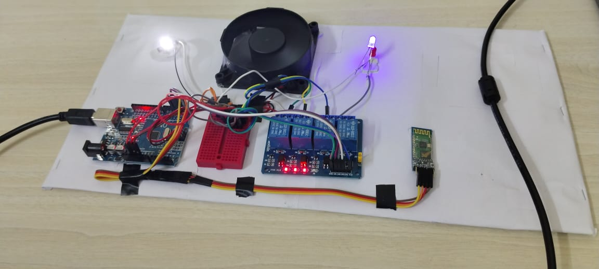

# Home Automation System

## 📖 Description
The **Home Automation System** is a smart solution to control and monitor your home appliances through a mobile application using Bluetooth connectivity. This project enables you to manage lights, fans, air conditioners, and heaters effortlessly from anywhere within your home.

## 🚀 Features
- **Mobile Application Control**: Operate appliances via a user-friendly mobile app.
- **Bluetooth Connectivity**: Seamless communication between your phone and the system.
- **Appliance Control**: Manage lights, fans, AC, and heaters conveniently.
- **Energy Efficiency**: Reduce power consumption by monitoring appliance usage.

## 📂 Project Contents
- **Video Demonstration**: [Video Demonstration](./project-video-1.mp4) 
- **Photo Overview**: 

## 🛠️ How It Works
1. **Connect**: Pair your smartphone with the system via Bluetooth.
2. **Control**: Use the app to toggle appliances ON/OFF and adjust settings.
3. **Monitor**: Keep track of appliance status in real time.

## 🖼️ Media
- **Video**: Watch the demonstration at `./media/demo.mp4`.
- **Image**: View the system setup snapshot at `./media/snapshot.jpg`.

## 🌟 Benefits
- **Convenience**: Control appliances from anywhere at home.
- **Cost-Effective**: Affordable and easy to implement.
- **Future-Ready**: A step towards a fully automated smart home.

---
